Je suis développeur Full Stack. Je fais des applis web et mobiles, des mondes en réalité virtuelle, et des scripts pour les petites frustrations du quotidien.

Je suis passé par le design avant le code, et ça se sent dans ma façon de travailler : je pense d'abord aux gens qui vont se servir de l'outil, et seulement ensuite à la stack. Avant de choisir un framework, je cherche à comprendre ce qui coince aujourd'hui, ce qui fait perdre du temps, ce qu'on contourne faute de mieux.

En réalité virtuelle, j'aime quand le décor raconte l'histoire : dans mon escape game, c'est le son qui guide la fouille. Et quand un petit truc m'agace au quotidien, j'écris un script pour ne plus jamais y penser.

  

### 🔭 Équipement de bord

**Web et mobile** 

**Back-end** 

**Réalité virtuelle** 

**Mise en production** 

**Design** 

### 📡 Ouvrir un canal

  

