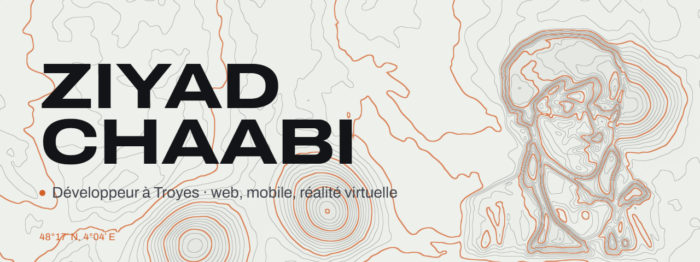

<a href="https://ziyad-chaabi.github.io/">
  <picture>
    <source media="(prefers-color-scheme: dark)" srcset="assets/banner-dark.png">
    
  </picture>
</a>

Je fais des applis web et mobiles, des mondes en réalité virtuelle, et des scripts pour les petites frustrations du quotidien. Je suis passé par le design avant le code : je pense d'abord aux gens qui vont se servir de l'outil, et seulement ensuite à la stack.

**[Voir le portfolio →](https://ziyad-chaabi.github.io/)**

### En ce moment

[SubForge](https://ziyad-chaabi.github.io/projets/subforge.html), un coach nutrition où l'on décrit son repas en une phrase. L'IA propose, la personne décide. React Native, Supabase, Gemini.

### Quelques projets

<table>
  <tr>
    <td width="33%" valign="top">
       
      <b>BTP-360</b> 
      Une seule application à la place des fichiers Excel de quatre entreprises du BTP. Angular, NestJS, AWS.
    </td>
    <td width="33%" valign="top">
       
      <b>Hotel Murder VR</b> 
      Un escape game d'enquête en réalité virtuelle, où le son guide la fouille. Unity 6.
    </td>
    <td width="33%" valign="top">
       
      <b>lolop</b> 
      Le compagnon League of Legends que je voulais dans la poche, même sans réseau. Android.
    </td>
  </tr>
  <tr>
    <td width="33%" valign="top">
       
      <b>Distri Sûr France</b> 
      Dix mois d'alternance pour créer une boutique en ligne, des maquettes à la mise en ligne. Odoo.
    </td>
    <td width="33%" valign="top">
       
      <b>Turaty Naturels</b> 
      Une boutique de cosmétiques bio, du catalogue jusqu'à la facture. Symfony, Stripe.
    </td>
    <td width="33%" valign="top">
       
      <b>ZABI</b> 
      Un duel de super-héros au tour par tour, façon arcade, parmi 731 personnages. Express, MongoDB.
    </td>
  </tr>
</table>

Le reste, des exercices d'école aux scripts du dimanche, est rangé sur [la carte du labo](https://ziyad-chaabi.github.io/labo.html).

### Avec quoi je travaille

**Web et mobile** : TypeScript, Angular, Ionic, React Native 
**Back-end** : NestJS, PostgreSQL, Prisma, Supabase 
**Réalité virtuelle** : Unity, C#, XR Interaction Toolkit 
**Mise en production** : Docker, AWS, Terraform, GitHub Actions 
**Design** : Figma, suite Adobe

### Hors de l'écran

Le manga (JoJo, surtout Steel Ball Run), League of Legends, la muscu, et l'équipe e-sport de l'INSA pendant le master. Presque tous mes projets perso sont nés de là.

### Me joindre

[Portfolio](https://ziyad-chaabi.github.io/) · [LinkedIn](https://www.linkedin.com/in/ziyad-chaabi/) · [Instagram](https://www.instagram.com/ziyad_chb/) · [ziyadou2011@hotmail.fr](mailto:ziyadou2011@hotmail.fr)
